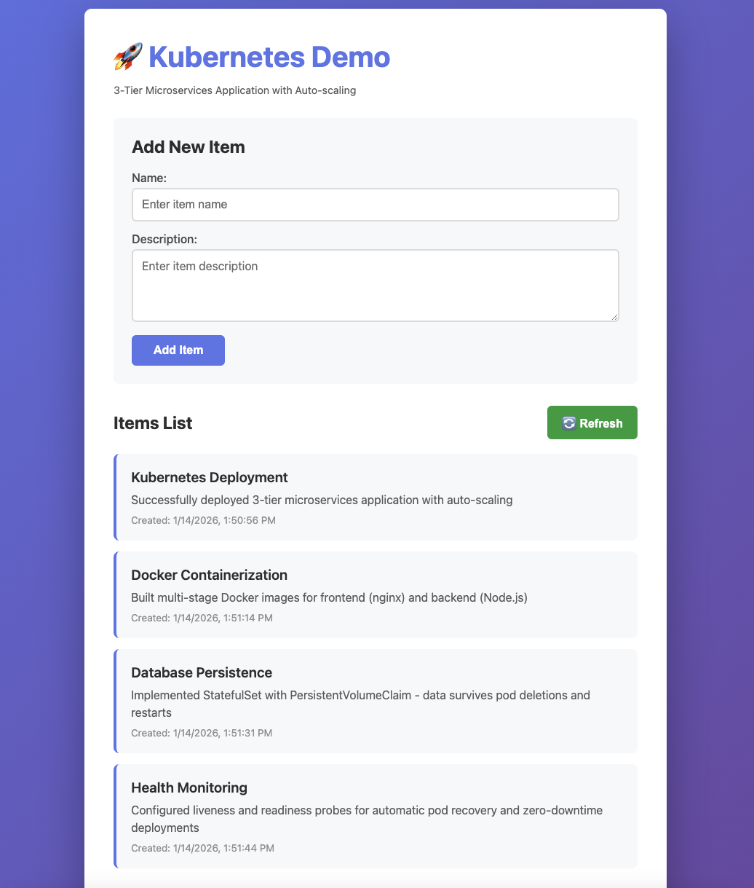
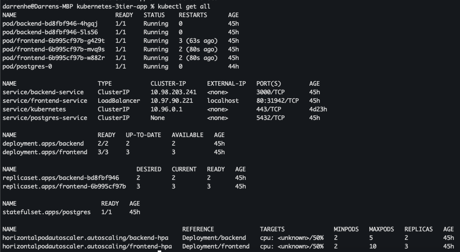
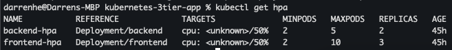
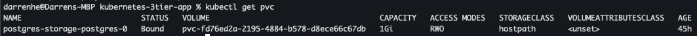

# Kubernetes 3-Tier Microservices Application

A production-ready demonstration of containerized microservices architecture deployed on Kubernetes with auto-scaling, persistent storage, and health monitoring.


## Architecture
```
┌─────────────┐
│   Browser   │
└──────┬──────┘
       │ HTTP
       ▼
┌─────────────────────────────┐
│  Frontend (nginx)           │
│  - 3 replicas               │
│  - LoadBalancer service     │
│  - HPA (2-10 pods)          │
└──────┬──────────────────────┘
       │ /api/* → proxy
       ▼
┌─────────────────────────────┐
│  Backend (Node.js/Express)  │
│  - 2 replicas               │
│  - ClusterIP service        │
│  - HPA (2-5 pods)           │
└──────┬──────────────────────┘
       │ postgres-service:5432
       ▼
┌─────────────────────────────┐
│  Database (PostgreSQL)      │
│  - StatefulSet (1 replica)  │
│  - PersistentVolume (1GB)   │
│  - Headless service         │
└─────────────────────────────┘
```

## Screenshots

### Application UI


### Kubernetes Resources


### Auto-scaling Status


### Persistent Storage



### Components

**Frontend Layer**
- nginx web server serving static HTML/JavaScript
- Reverse proxy for backend API requests
- 3 replicas with auto-scaling (2-10 pods)
- Exposed via LoadBalancer service

**Backend Layer**
- Node.js + Express REST API
- PostgreSQL database integration
- 2 replicas with auto-scaling (2-5 pods)
- Internal ClusterIP service

**Database Layer**
- PostgreSQL 15 with StatefulSet
- Persistent volume for data storage (1GB)
- Headless service for stable network identity

### Key Features

- **Auto-scaling**: HorizontalPodAutoscaler based on CPU metrics (50% threshold)
- **High Availability**: Multiple replicas with automatic failover
- **Data Persistence**: StatefulSet with PersistentVolumeClaim
- **Health Monitoring**: Liveness and readiness probes
- **Resource Management**: CPU/memory requests and limits
- **Service Discovery**: Internal DNS for service-to-service communication

## Technology Stack

- **Container Runtime**: Docker
- **Orchestration**: Kubernetes 1.34
- **Frontend**: nginx, HTML5, JavaScript (ES6+)
- **Backend**: Node.js 18, Express 4
- **Database**: PostgreSQL 15
- **Configuration**: ConfigMaps, Secrets

## Prerequisites

- Docker Desktop with Kubernetes enabled
- kubectl CLI tool
- 4GB RAM minimum
- 10GB disk space

## Deployment

### 1. Clone Repository

```bash
git clone https://github.com/YOUR_USERNAME/kubernetes-3tier-app.git
cd kubernetes-3tier-app
```

### 2. Build Docker Images

```bash
docker build -t backend:v1 ./backend
docker build -t frontend:v1 ./frontend
```

### 3. Deploy to Kubernetes

```bash
# Deploy configuration
kubectl apply -f backend/k8s/configmap.yaml
kubectl apply -f backend/k8s/secret.yaml

# Deploy database
kubectl apply -f database/k8s/
kubectl wait --for=condition=ready pod -l app=postgres --timeout=120s

# Deploy backend
kubectl apply -f backend/k8s/
kubectl wait --for=condition=ready pod -l app=backend --timeout=120s

# Deploy frontend
kubectl apply -f frontend/k8s/
kubectl wait --for=condition=ready pod -l app=frontend --timeout=120s
```

### 4. Access Application

```bash
kubectl get service frontend-service
```

Open browser to `http://localhost`

## Verification

### Check All Resources

```bash
kubectl get all
```

### Test Auto-scaling

```bash
kubectl get hpa
kubectl scale deployment frontend --replicas=5
```

### Test Data Persistence

```bash
# Add items via UI
# Delete database pod
kubectl delete pod postgres-0
# Verify data still exists after pod recreates
```

### View Logs

```bash
kubectl logs -l app=backend
kubectl logs -l app=frontend
kubectl logs postgres-0
```

## Architecture Decisions

### Why StatefulSet for Database?

StatefulSets provide stable network identities and persistent storage guarantees which is essential for databases. Each pod gets a predictable name (postgres-0) and dedicated storage that survives pod restarts.

### Why ClusterIP for Backend?

The backend API is internal-only, accessed by frontend via service discovery. ClusterIP provides internal load balancing without external exposure, following least-privilege security principles.

### Why LoadBalancer for Frontend?

Frontend needs external access for users. LoadBalancer type exposes the service with a public endpoint (localhost on Docker Desktop, external IP on cloud).

### Resource Limits Strategy

- Frontend: Low resources (64Mi/50m requests) - stateless, lightweight nginx
- Backend: Medium resources (128Mi/100m requests) - API processing overhead
- Database: High resources (256Mi/250m requests) - data processing demands

## Troubleshooting

### Pods Not Starting

```bash
kubectl describe pod <pod-name>
kubectl logs <pod-name>
```

### Backend Can't Connect to Database

Check if postgres service exists and pod is running:
```bash
kubectl get service postgres-service
kubectl get pods -l app=postgres
```

### Can't Access Frontend

Use port-forward if LoadBalancer shows pending:
```bash
kubectl port-forward service/frontend-service 8080:80
```

Visit `http://localhost:8080`

## Cleanup

```bash
kubectl delete -f frontend/k8s/
kubectl delete -f backend/k8s/
kubectl delete -f database/k8s/
kubectl delete pvc postgres-storage-postgres-0
```

## Future Enhancements

- [ ] Add Prometheus + Grafana monitoring
- [ ] Implement CI/CD pipeline with GitHub Actions
- [ ] Add Ingress controller for routing
- [ ] Deploy to cloud (AWS EKS, GCP GKE)
- [ ] Add database replication (read replicas)
- [ ] Implement blue/green deployments
- [ ] Add network policies for security
- [ ] Configure TLS/HTTPS

## Author

Darren He - [GitHub](https://github.com/YOUR_USERNAME) - [LinkedIn](https://linkedin.com/in/darrenche)

## License

MIT
